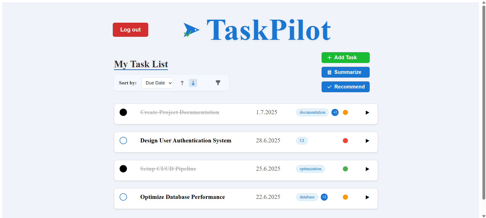
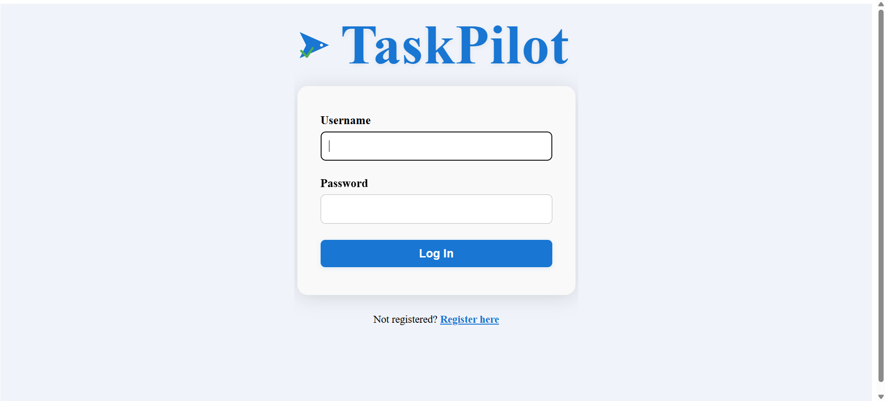
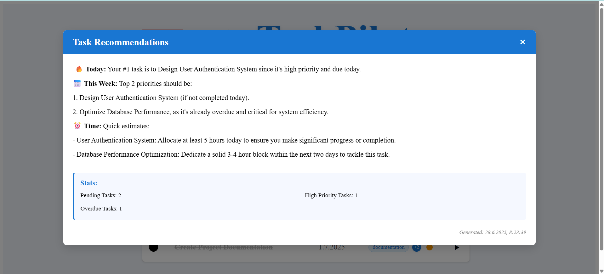

# TaskPilot
[](https://python.org)
[](https://fastapi.tiangolo.com)
[](https://reactjs.org)
[](https://docker.com)
[](#testing)

## Overview
TaskPilot is a modern full-stack task management application with a React frontend and FastAPI backend. It features secure JWT-based authentication, robust task management, and advanced AI-driven capabilities. The entire system is containerized using Docker, leverages Redis caching, and is fully prepared for CI/CD deployment.



## Key Features
- 🔐 Secure multi-user authentication with JWT tokens and password hashing
- 📝 Comprehensive task management with tags, priorities, and due dates
- 🖥️ Modern React frontend with responsive design
- 🤖 AI-powered task suggestions and summaries
- 🚀 FastAPI backend delivering high performance and easy scalability
- ⚡ Redis caching for improved response times
- 📦 Fully containerized with Docker and Docker Compose
- 🧪 Extensive automated tests for both frontend and backend
- 🔄 CI/CD pipeline integration with GitHub Actions and Render.com

## Project Architecture
```
TaskPilot/
├── app/                # FastAPI backend
│   ├── api/            # API endpoints and routers
│   ├── services/       # Business logic layer
│   ├── repositories/   # Data access layer
│   ├── models/         # Data models
│   ├── core/           # Core configuration
│   ├── db/             # Database session
│   └── cache/          # Redis caching
├── client/             # React frontend
│   ├── src/            # Frontend source code
│   │   ├── components/ # Reusable UI components
│   │   ├── pages/      # Application pages
│   │   ├── services/   # API service calls
│   │   └── types/      # TypeScript types
│   └── public/         # Static assets
├── docker/             # Docker configuration
│   ├── Dockerfile      # Backend container
│   ├── client.DockerFile # Frontend container
│   └── docker-compose.yml # Container orchestration
├── tests/              # Backend tests
└── data/               # Persistent database files
```

## Technologies
- **Frontend:** React, TypeScript, Vite
- **Backend:** Python 3.12, FastAPI
- **Authentication:** JWT tokens, bcrypt
- **Database:** SQLite with SQLModel
- **Cache:** Redis
- **Containerization:** Docker, Docker Compose
- **Web Server:** Nginx (frontend), Uvicorn (backend)
- **AI Integration:** OpenRouter API
- **Testing:** pytest (backend), Jest (frontend)

## Setup & Usage

### Prerequisites
- Docker Desktop installed and running
- An OpenRouter API key (for AI features)

### Running the Application
```bash
cd docker
docker compose up --build -d
```

The application will be available at:
- **Frontend:** http://localhost
- **Backend API:** http://localhost:8000
- **API docs:** http://localhost:8000/docs

##

**Login Page:**


**AI Recommendations:**


## Features Overview

### User Authentication
- Register new accounts
- Secure login with JWT
- Protected routes for authenticated users

### Task Management
- Create, view, edit, and delete tasks
- Set priorities (low, medium, high)
- Add due dates and descriptions
- Tag tasks for better organization
- Mark tasks as complete
- Add mini-tasks to break down complex items

### AI Integration
- Get AI-powered task summaries
- Receive intelligent task recommendations
- Natural language processing of task descriptions

## Environment Configuration
Create a `docker/.env` file with:
```env
SECRET_KEY=your-secret-key
JWT_SECRET_KEY=your-jwt-secret
AI_API_KEY=your-openrouter-api-key
```

## Testing
```bash
# Backend tests
docker compose exec web pytest tests/ -v

# Client build verification
docker compose ps client
```

## Deployment
TaskPilot is configured for seamless deployment on Render.com:
- Fully configured GitHub Actions CI/CD pipeline
- Automatic testing and building on every push
- Production deployment when merging to main branch
- Docker-based deployment with render.yaml configuration

## Future Improvements
- Implement real-time notifications with WebSockets
- Add mobile app companion (React Native)
- Enhance AI capabilities with additional models
- Enable team collaboration features
- Add Kanban board view for tasks

## Contact
Created by Roee Shlosberg — bioinformatics student and software developer passionate about full-stack applications with AI integration.
